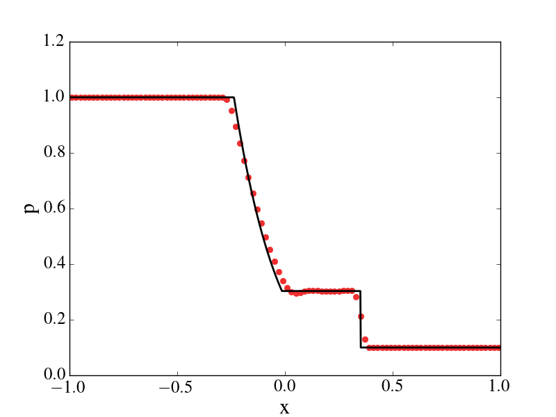

# Regression test suite

Execute `run_regression.py` to run the regression test suite.

## Test cases

The domain is [-1, 1], the ratio of specific heats is 1.4, the CFL is
0.5, and the number of elements is 100. The exact solution was
generated with an exact Riemann solver.

Test | x0 | End time | rhoL | uL | pL | rhoR | uR | pR
-----|-----|----------|------|----|----|------|----|---
Sod shock tube                         |  0   | 0.2   |       1|         0|       1|   0.125|     0.0|     0.1
Modified Sod shock tube                | -0.4 | 0.2   |       1|      0.75|     1.0|   0.125|     0.0|     0.1
123 problem                            |  0   | 0.15  |       1|      -2.0|     0.4|     1.0|     2.0|     0.4
Blast wave (Left Woodward and Colella) |  0   | 0.012 |       1|       0.0|  1000.0|     1.0|     0.0|    0.01
collision of two strong shocks         | -0.2 | 0.035 | 5.99924|   19.5975| 460.894| 5.99242|-6.19633| 46.0950
stationary contact discontinuity       |  0   | 2.0   |     1.4|       0.0|     1.0|     1.0|     0.0|     1.0

## Sod Shock tube
Code options can be found [here](./sodtube/deck.inp).

# Modified Sod shock tube
Code options can be found [here](sodtube_modified/deck.inp).

# 123 problem
Code options can be found [here](123_problem/deck.inp).

# Blast wave (Left Woodward and Colella)
Code options can be found [here](blast_wave/deck.inp).

# Collision of two strong shocks
Code options can be found [here](strong_shocks/deck.inp).

# Stationary contact discontinuity 
Code options can be found [here](stationary_contact/deck.inp).
